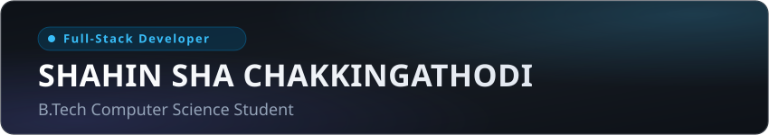

<div align="center">
  

  <br />

  <p align="center">
    <b>Full-Stack Developer</b> &bull; <b>B.Tech Computer Science Student</b> &bull; <b>DevOps &amp; Cloud Enthusiast</b>
  </p>
  <p align="center">
    <em>Building resilient software systems, real-time web applications, and containerized deployment workflows.</em>
  </p>
</div>

---

### Quick Signal

```
  Role:           Full-Stack Developer (B.Tech Computer Science)
  Core Stack:     TypeScript, React, Next.js, Node.js, NestJS, Python Flask, PostgreSQL
  Learning Path:  DevOps Fundamentals (Docker, CI/CD, Linux, Containerization)
  Focus Areas:    Modular Web Architectures, Real-Time Data Handling, System Reliability
  Location:       Kerala, India
```

---

### About Me

I am a **Computer Science undergraduate** and **Full-Stack Developer** based in Kerala, India. My engineering work centers on building practical, full-lifecycle software systems—from database modeling and secure backend APIs to reactive, accessible client applications.

Alongside full-stack engineering, I am actively expanding my skillset into **DevOps and cloud infrastructure**. I focus on understanding containerization with Docker, setting up automated CI/CD pipelines, and establishing dependable application delivery practices.

---

### Currently Learning &amp; Exploring (DevOps &amp; Cloud)

I am actively strengthening my infrastructure and operational foundations to bridge the gap between software development and production delivery:

* 🐳 **Containerization:** Writing clean multi-stage `Dockerfile` configurations and orchestrating multi-service environments with **Docker Compose** (NestJS, Flask, PostgreSQL, React).
* ⚙️ **CI/CD Pipelines:** Setting up automated testing and linting workflows with **GitHub Actions** to enforce code quality before merge.
* 🐧 **Linux &amp; Shell:** Developing daily proficiency in Linux CLI fundamentals, bash automation scripts, and process management.
* 🚀 **Deployment Automation:** Managing cloud and serverless deployments on **Vercel**, including SPA rewrite rules, build scripts, and environment configuration.
* 🌐 **Networking &amp; Security Basics:** Understanding reverse proxies, CORS policies, environment isolation, and secure API gateways.

---

### Tech Stack

#### Core Languages
[](https://www.typescriptlang.org/)
[](https://developer.mozilla.org/en-US/docs/Web/JavaScript)
[](https://www.python.org/)
[](https://www.postgresql.org/)

#### Additional Languages
[](https://www.oracle.com/java/)
[](https://learn.microsoft.com/en-us/dotnet/csharp/)

#### Frontend Architecture
[](https://react.dev/)
[](https://nextjs.org/)
[](https://vitejs.dev/)
[](https://tailwindcss.com/)
[](https://zustand.docs.pmnd.rs/)
[](https://reactrouter.com/)

#### Backend &amp; Real-Time APIs
[](https://nodejs.org/)
[](https://nestjs.com/)
[](https://expressjs.com/)
[](https://flask.palletsprojects.com/)
[](https://socket.io/)
[](https://restfulapi.net/)

#### Databases &amp; ORMs
[](https://www.postgresql.org/)
[](https://supabase.com/)
[](https://www.prisma.io/)
[](https://www.sqlalchemy.org/)

#### DevOps &amp; Cloud (Learning &amp; Practice)
[](https://www.docker.com/)
[](https://github.com/features/actions)
[](https://www.linux.org/)
[](https://vercel.com/)
[](https://git-scm.com/)
[](https://eslint.org/)

---

### Featured Projects

#### 🏥 HospitalOS + PharmacyERP
A comprehensive Hospital Information System and Pharmacy Management platform engineered for synchronized clinical workflows and inventory tracking.

* **Stack:** `NestJS` &bull; `React` &bull; `TypeScript` &bull; `Prisma ORM` &bull; `PostgreSQL` &bull; `Docker` &bull; `C#`
* **Architecture Highlight:** Multi-service application orchestrating a NestJS backend API, a Python ML intelligence module, and a responsive React client via Docker Compose.
* **Key Capabilities:**
  * Role-based clinical workspaces with granular route protection for Doctors, Nurses, Pharmacists, and Administrative staff.
  * Automated **FEFO (First-Expired, First-Out)** batch selection engine to prevent drug wastage in hospital pharmacies.
  * Systematic bed taxonomy and permanent patient identifier (UHID) allocation across clinical departments.

&rarr; **[View Repository](https://github.com/Shahinshac/HospitalOs)**

<br />

#### 🧾 Restaurant Billing &amp; Real-Time POS
A full-stack dining management, digital menu, and point-of-sale system featuring instant kitchen synchronization.

* **Stack:** `Next.js` &bull; `Node.js` &bull; `Express` &bull; `Socket.io` &bull; `Prisma ORM` &bull; `PostgreSQL` &bull; `Razorpay`
* **Architecture Highlight:** Event-driven architecture using WebSockets (`Socket.io`) to broadcast incoming orders from table QR menus to the Kitchen Display System (KDS) without polling.
* **Key Capabilities:**
  * Dynamic table-specific QR code ordering and digital menu catalog.
  * Live kitchen order dispatch and status progression via bidirectional WebSocket channels.
  * Integrated payment processing with Razorpay order verification and printable receipt generation.

&rarr; **[View Repository](https://github.com/Shahinshac/restaurant-billing)** &bull; **[Live Demo (Login required)](https://restaurant-billing-phi.vercel.app)**

<br />

#### 🏦 Core Banking System (CBS)
A multi-branch financial operations platform managing customer accounts, teller transactions, and structured loan evaluations.

* **Stack:** `React 19` &bull; `TypeScript` &bull; `Python Flask` &bull; `Flask-SQLAlchemy` &bull; `PostgreSQL` &bull; `JWT`
* **Architecture Highlight:** Polyglot architecture combining a secure Python Flask financial REST API with a modern React 19 / TypeScript administrative portal.
* **Key Capabilities:**
  * Teller workspace for deposits, withdrawals, transfers, and account provisioning.
  * Structured loan processing desk supporting application submission, review, approval, disbursement, and EMI calculation.
  * Traceable activity logs tracking administrative and financial operations.

&rarr; **[View Repository](https://github.com/Shahinshac/CBS)**

<br />

#### 🔍 Code Quality Analyzer
An automated static analysis system that inspects code maintainability, calculates structural complexity metrics, and suggests refactoring anti-patterns.

* **Stack:** `Python` &bull; `Flask` &bull; `AST Parsing` &bull; `Scikit-learn` &bull; `Docker` &bull; `Pytest` &bull; `GitHub Actions`
* **Architecture Highlight:** Abstract Syntax Tree (AST) inspection engine that calculates source code metrics deterministically without executing unverified code.
* **Key Capabilities:**
  * Code metric computation: Cyclomatic complexity, Halstead volume, and Maintainability Index.
  * Rule-based detector for code smells, deep nesting, unused imports, and common vulnerability patterns.
  * Containerized deployment with Docker and automated testing via GitHub Actions CI pipelines.

&rarr; **[View Repository](https://github.com/Shahinshac/Code-Quality-Analyzer)**

---

### Engineering Highlights

* **System Design &amp; Roles:** Implemented Role-Based Access Control (RBAC) across clinical, banking, and commercial platforms using JWT authentication guards and protected client routes.
* **Real-Time Communication:** Designed event-driven WebSocket pipelines with Socket.io for immediate multi-screen order dispatch and state coordination.
* **Database Architecture:** Built normalized relational schemas and data access layers with PostgreSQL, managed via Prisma and SQLAlchemy ORM migrations.
* **DevOps &amp; Automation Practices:** Containerized multi-tier applications using Docker Compose and established automated test pipelines in GitHub Actions.

---

### GitHub Activity

<div align="center">
  <a href="https://github.com/Shahinshac">
    <picture>
      <source media="(prefers-color-scheme: dark)" srcset="https://streak-stats.demolab.com?user=Shahinshac&theme=github-dark-dimmed&hide_border=true&date_format=M%20j%5B%2C%20Y%5D" />
      <source media="(prefers-color-scheme: light)" srcset="https://streak-stats.demolab.com?user=Shahinshac&theme=default&hide_border=true&date_format=M%20j%5B%2C%20Y%5D" />
      
    </picture>
  </a>
</div>

---

### Connect With Me

I am always open to discussing software architecture, systems engineering, and collaborative technical projects.

[](https://github.com/Shahinshac)
[](https://x.com/shaahn_c)
[](https://instagram.com/shaahn_c)
[](mailto:shahin.c.sha@gmail.com)

<br />

* 📍 **Location:** Kerala, India
* 💬 *Open to contributing to open-source software, technical discussions, and software engineering opportunities.*
