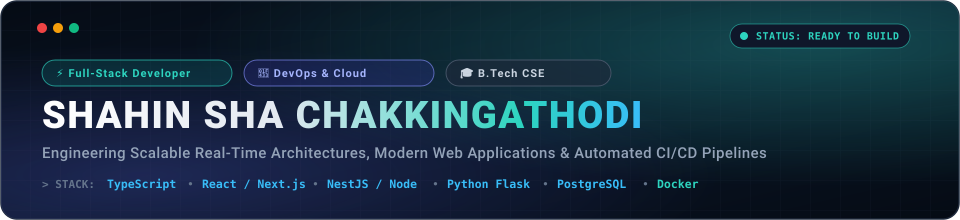

<div align="center">
  <!-- Custom Header Banner -->
  <a href="https://shahinshac.vercel.app" target="_blank">
    
  </a>

  <br/><br/>

  <!-- Dynamic Typing Indicator -->
  

  <br/><br/>

  <p align="center">
    <b>Full-Stack Developer</b> &nbsp;&bull;&nbsp; <b>B.Tech Computer Science Student</b> &nbsp;&bull;&nbsp; <b>DevOps &amp; Cloud Explorer</b>
  </p>
  <p align="center">
    <em>Building resilient software systems, real-time web architectures, and containerized deployment workflows.</em>
  </p>

  <br/>

  <!-- Connect & Social Badges -->
  <p align="center">
    <a href="https://shahinshac.vercel.app" target="_blank">
      
    </a>
    &nbsp;
    <a href="https://www.linkedin.com/in/shahinshac" target="_blank">
      
    </a>
    &nbsp;
    <a href="mailto:shahin.c.sha@gmail.com">
      
    </a>
    &nbsp;
    <a href="https://x.com/shaahn_c" target="_blank">
      
    </a>
    &nbsp;
    <a href="https://instagram.com/shaahn_c" target="_blank">
      
    </a>
  </p>

  <!-- Profile Views & Followers -->
  <p align="center">
    
    &nbsp;
    
  </p>
</div>

---

### ⚡ Engineering Overview

Hi, I'm **Shahin Sha Chakkingathodi** ([@Shahinshac](https://github.com/Shahinshac)), a Computer Science Engineering student and Full-Stack Developer based in Kerala, India. My engineering work centers on architecting practical, full-lifecycle software systems—from normalized database schemas and secure backend APIs to reactive, accessible client applications and automated cloud deployments.

```typescript
const engineer = {
  name: "Shahin Sha Chakkingathodi",
  location: "Kerala, India 🇮🇳",
  degree: "B.Tech in Computer Science & Engineering",
  coreStack: ["TypeScript", "React", "Next.js", "Node.js", "NestJS", "Python Flask", "PostgreSQL"],
  devOpsFocus: ["Docker", "Docker Compose", "GitHub Actions CI/CD", "Linux Automation", "Vercel"],
  architectureInterests: ["Event-Driven WebSockets", "Role-Based Access Control", "Microservices", "FEFO Inventory Engines"],
  currentLearning: "Strengthening container orchestration, cloud deployment pipelines, and resilient distributed workflows",
  portfolio: "https://shahinshac.vercel.app"
};
```

---

### 🐳 DevOps &amp; Cloud Exploration Pipeline

<div align="center">
  
</div>

<br/>

I am actively strengthening my infrastructure and operational foundations to bridge software development and production delivery:

* 🐳 **Containerization:** Writing clean multi-stage `Dockerfile` configurations and orchestrating multi-service environments with **Docker Compose** (NestJS, Flask, PostgreSQL, React).
* ⚙️ **CI/CD Automation:** Building automated test suites, linting routines, and pull request verification workflows with **GitHub Actions**.
* 🐧 **Linux &amp; Shell Automation:** Daily hands-on proficiency in Linux CLI administration, bash scripting, and process management.
* 🚀 **Cloud Deployments:** Configuring and maintaining production deployments on **Vercel** with SPA routing, build optimizations, and environment variables.
* 🔒 **Security &amp; Networking:** Implementing RBAC authorization, reverse proxies, CORS policies, JWT authentication, and secure API gateways.

---

### 🛠️ Tech Stack &amp; Tools

<div align="center">

#### Core Languages &amp; Runtimes
[](https://www.typescriptlang.org/)
[](https://developer.mozilla.org/en-US/docs/Web/JavaScript)
[](https://www.python.org/)
[](https://www.postgresql.org/)
[](https://www.oracle.com/java/)
[](https://learn.microsoft.com/en-us/dotnet/csharp/)

#### Frontend Architecture
[](https://react.dev/)
[](https://nextjs.org/)
[](https://vitejs.dev/)
[](https://tailwindcss.com/)
[](https://zustand.docs.pmnd.rs/)
[](https://reactrouter.com/)

#### Backend &amp; Real-Time APIs
[](https://nestjs.com/)
[](https://nodejs.org/)
[](https://expressjs.com/)
[](https://flask.palletsprojects.com/)
[](https://socket.io/)
[](https://restfulapi.net/)

#### Databases &amp; ORMs
[](https://www.postgresql.org/)
[](https://supabase.com/)
[](https://www.prisma.io/)
[](https://www.sqlalchemy.org/)

#### DevOps, Cloud &amp; Tooling
[](https://www.docker.com/)
[](https://github.com/features/actions)
[](https://www.linux.org/)
[](https://vercel.com/)
[](https://git-scm.com/)
[](https://eslint.org/)

</div>

---

### 🏆 Featured Projects

#### 🏥 [HospitalOS + PharmacyERP](https://github.com/Shahinshac/HospitalOs)
> **Comprehensive Hospital Information &amp; Pharmacy ERP Platform** engineered for clinical workflows, bed allocation, and automated batch tracking.

* **Tech Stack:** `NestJS` &bull; `React` &bull; `TypeScript` &bull; `Prisma ORM` &bull; `PostgreSQL` &bull; `Docker` &bull; `C#`
* **Architecture:** Multi-service application orchestrating a NestJS backend API, a Python ML intelligence module, and a React web client containerized via Docker Compose.
* **Key Highlights:**
  * **FEFO Engine:** Automated First-Expired, First-Out batch selection preventing pharmaceutical expiration and inventory waste.
  * **Clinical Workspaces:** Granular Role-Based Access Control (RBAC) workspaces for Doctors, Pharmacists, and Nurses.
  * **Permanent Identifiers:** Systematic bed taxonomy and permanent patient identifier (UHID) allocation across departments.
* 🔗 **Repository:** [github.com/Shahinshac/HospitalOs](https://github.com/Shahinshac/HospitalOs)

<br/>

#### 🧾 [Restaurant Billing &amp; Real-Time POS](https://github.com/Shahinshac/restaurant-billing)
> **Dining Management &amp; Kitchen Display System** featuring instant QR digital menu ordering and bidirectional WebSocket order dispatch.

* **Tech Stack:** `Next.js` &bull; `Node.js` &bull; `Express` &bull; `Socket.io` &bull; `Prisma ORM` &bull; `PostgreSQL` &bull; `Razorpay`
* **Architecture:** Event-driven architecture utilizing WebSockets (`Socket.io`) to stream table orders directly to the Kitchen Display System (KDS) without polling.
* **Key Highlights:**
  * **Real-Time KDS:** Instant kitchen order dispatch and multi-screen state coordination.
  * **Table QR Ordering:** Table-specific dynamic QR code menu catalog with real-time cart state.
  * **Integrated Checkout:** Seamless Razorpay payment verification and printable receipt generation.
* 🔗 **Repository:** [github.com/Shahinshac/restaurant-billing](https://github.com/Shahinshac/restaurant-billing) &bull; **Live Demo:** [restaurant-billing-phi.vercel.app](https://restaurant-billing-phi.vercel.app)

<br/>

#### 🏦 [Core Banking System (CBS)](https://github.com/Shahinshac/CBS)
> **Multi-Branch Financial Operations Platform** managing customer accounts, teller operations, and loan processing with immutable audit logs.

* **Tech Stack:** `React 19` &bull; `TypeScript` &bull; `Python Flask` &bull; `Flask-SQLAlchemy` &bull; `PostgreSQL` &bull; `JWT`
* **Architecture:** Polyglot architecture combining a secure Python Flask financial REST API with a modern React 19 / TypeScript administrative portal.
* **Key Highlights:**
  * **Teller Desk:** High-integrity deposits, withdrawals, fund transfers, and ledger accounting.
  * **Loan Management:** Structured loan application desk with multi-stage approval, disbursement tracking, and EMI calculations.
  * **Audit Logging:** Traceable audit logs recording critical administrative and transaction events.
* 🔗 **Repository:** [github.com/Shahinshac/CBS](https://github.com/Shahinshac/CBS)

<br/>

#### 🔍 [Code Quality Analyzer](https://github.com/Shahinshac/Code-Quality-Analyzer)
> **Automated Static Code Analysis Platform** calculating complexity metrics, maintainability indexes, and detecting architectural code smells.

* **Tech Stack:** `Python` &bull; `Flask` &bull; `AST Parsing` &bull; `Scikit-learn` &bull; `Docker` &bull; `Pytest` &bull; `GitHub Actions`
* **Architecture:** Deterministic Abstract Syntax Tree (AST) inspection engine that parses and analyzes Python source code without executing unverified files.
* **Key Highlights:**
  * **Metric Computation:** Calculates Cyclomatic Complexity, Halstead Volume, and Maintainability Index scores.
  * **Anti-Pattern Engine:** Detects cognitive complexity anti-patterns, deep nesting, dead code, and common vulnerabilities.
  * **Containerized CI:** Multi-stage Docker container with automated Pytest suites running on GitHub Actions.
* 🔗 **Repository:** [github.com/Shahinshac/Code-Quality-Analyzer](https://github.com/Shahinshac/Code-Quality-Analyzer)

---

### 📊 GitHub Activity &amp; Streak

<div align="center">
  <a href="https://github.com/Shahinshac">
    <picture>
      <source media="(prefers-color-scheme: dark)" srcset="https://streak-stats.demolab.com?user=Shahinshac&theme=tokyonight&hide_border=true&date_format=M%20j%5B%2C%20Y%5D&background=090D16&ring=38BDF8&fire=38BDF8&currStreakLabel=38BDF8" />
      <source media="(prefers-color-scheme: light)" srcset="https://streak-stats.demolab.com?user=Shahinshac&theme=default&hide_border=true&date_format=M%20j%5B%2C%20Y%5D" />
      
    </picture>
  </a>
</div>

<br/>

<div align="center">
  <a href="https://github.com/Shahinshac">
    
  </a>
</div>

---

<div align="center">
  <p><em>"Continuous learning, clean architecture, and reliable systems."</em></p>
  <p><b>Designed &amp; Built with care by <a href="https://github.com/Shahinshac">Shahin Sha Chakkingathodi</a> &bull; © 2026</b></p>
</div>
